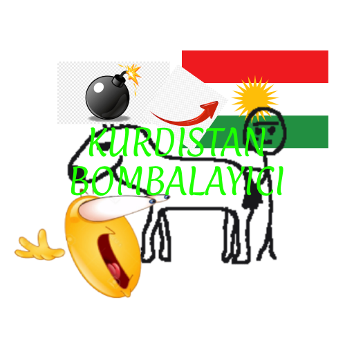

# Kurdistan bombalayici



Undertale tarzinda kurdistani bombaladigimiz bir oyun, tamamiyla zevk ve eglence amacli yapilmistir. Lutfen ciddiye almayiniz basimi belaya sokmayin!

Raylib kutuphanesini denemek istiyordum cok, raylibe baslamak isteyen varsa temel bir proje gibi dusunebilirsiniz.

Ve evet kodlarimin igrenc oldugunu biliyorum benim sucum degil...

## Build

```bash
make -j
```

## Run

`./build/bombkurdistan` ile calistirabilirsiniz su anlik sadece amd64 linuxde test ettim windowsda calisiyor mu bilmiyorum ama make kullanmakta basarilar :D

## Gameplay

https://github.com/user-attachments/assets/95879509-924b-4f56-b1af-2e562864e58d

## Special Thanks

Bu oyunun yapilmasinda yardimci olan ve bana ilham veren kisilere tesekkur ederim:

- [larei](https://github.com/lareii)
- [kosero](https://github.com/kosero)
- yesil asya

## License

[MIT](LICENSE)
